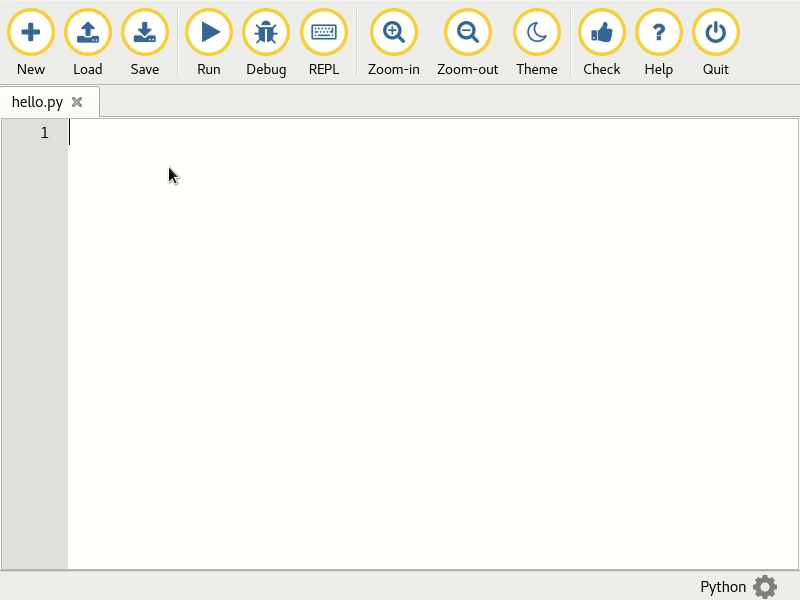

# Developing Mu's Website

The purpose of Mu's main website, https://codewith.mu
is to provide four things:

* Instructions for getting Mu.
* Learning oriented tutorials to show users how to get started with Mu.
* Goal oriented "how-to" guides that show how to solve a specific problems or
  achieve particular tasks.
* Links to other community-related resources such as the developer
  documentation you're reading right now, and online community discussions.

The site itself is hosted for free on
[GitHub Pages](https://pages.github.com/) as a
[Jekyll created static site](https://jekyllrb.com/). The source code is found
in the [mu-editor.github.io](https://github.com/mu-editor/mu-editor.github.io)
repository. As soon as a new change lands in the master branch of the site's
repository, GitHub automatically rebuilds the site and deploys it. This means
everything is simple and automated.

We expect everyone participating in the development of the website to act in
accordance with our [code of conduct](code_of_conduct.md).

Developer Setup
+++++++++++++++

1. Follow the instructions for your operating system to install the
   [Jekyll static site generator](https://jekyllrb.com/docs/installation/).
2. Get the source code from GitHub:
```
git clone https://github.com/mu-editor/mu-editor.github.io.git
```
3. From within the root directory of the website's source code, use Jekyll to
   build and serve the site locally:
```
jekyll serve
```
4. Point your browser to http://127.0.0.1:4000 to see the locally running
   version.

As you make changes to the website's source, Jekyll will automatically update
the locally running version so you'll immediately see your updates.

The source code is arranged as a typical Jekyll website except it's not a blog,
so there are no articles in the `_posts` directory.

Since we need our website to be easily translatable all the content will be in
a directory named after the ISO language code of the translation. For example,
all the original English content is in the `en` directory in the root of the
repository. All images should be in the `img` directory. If an image is for
a specific translation of the website, it should be in a subdirectory of
`img` which is named after the ISO language code (for example, as there is
for `img/en`).



We use GIF based screen captures throughout the site (such as on the front
page). The dimensions for such captures of Mu are 1140x660 pixels and must not
include the window title bar (provided by the operating system). So far, we
have found the [peek](https://github.com/phw/peek) utility on Linux an
excellent choice for making such GIF based screen captures.

When adding such animated screen grabs please ensure the `img` element has
the following classes (for the sake of visual consistency): `img-responsive
center-block img-rounded movie`.

## Internationalisation of the Website

There are two ways to contribute to the translation of Mu's website:

* Add / update existing content for your target language.
* Start a completely new translation for your target language.

When adding content to an existing translation of the website please remember
that files can be either HTML or Markdown. At the top of each file is a YAML
based header that must contain three entries: `layout` which must always
be `default`, `title` which should be the title of the page you're creating
and `i18n` which much be the ISO language code for your translation (this is
used so the correctly translated version of the site's menu is displayed).

For example, the YAML header for the `index.html` site in the `en`
sub-directory looks like this::

    ---
    layout: default
    title: Code With Mu
    i18n: en
    ---

The workflow for creating a new translation of the website is:

1. Create a new directory named after the
   [ISO language code](https://en.wikipedia.org/wiki/ISO_639-1) for the new
   translation. For example, if we were creating a new French translation of
   the site, we'd create a `fr` directory in the root of the repository.
2. Ensure there's a version of the `index.html` file found in the root of the
   repository, translated into the target language in the new directory you
   created in step 1. Also ensure you copy the structure of the main sections
   of the website found in the `en` version of the site.
3. In the `_includes` directory found in the root of the repository, you must
   add the new language as a list item in the `lang_list.html` template.
   Ensure that the href for the link points to the new directory, and the
   name of the translation is in the target language. For example,
   this is how an entry for French would look (note the use of the French word
   for "French"):
```
<li><a href="/fr/">Français</a></li>
```
4. In the same `_includes` directory, create a copy of the `nav_en.html`
   but with the `en` section of the name replaced with the ISO code for the
   new target language. For example, if we were to do this for a French
   translation, our new file would be called `nav_fr.html`. This file defines
   how the site's navigation bar should look. Make sure you translate the
   English version into your target language and remember to update the href
   values to use the new directory created in step 1.
5. Remember that the YAML headers for your new translation should have an
   `i18n` value with the expected ISO language code for the new target
   language. For example, if we were writing a new page for the French
   translation, the `i18n` entry would have the value `fr`.

Assuming you followed all the steps above, you should see your new language in
the "language" dropdown in the site navigation. Clicking on it should take you
to the `index.html` page in the new directory you created for the target
language, and the site navigation should reflect the newly translated
navigation template.

From this point on, it's just a case of adding content to the newly translated
version of the site in much the same way as it is done in the "default"
`en` directory.
